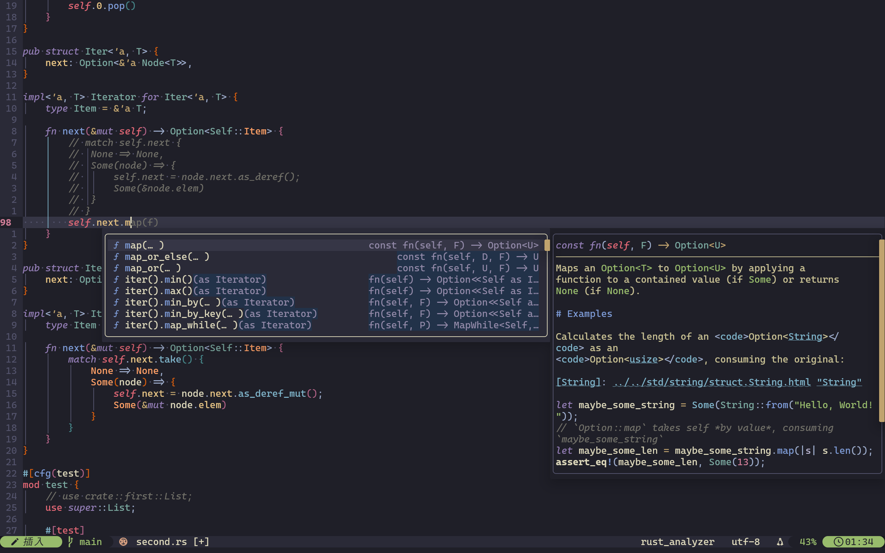

## 由 `Neovim` v0.12 & `vim.pack` 驱动. 为速度和美观而生.



## 环境依赖

1. `Neovim` v0.12+
2. 编译器: `gcc`, `g++`
3. Rust 工具链: `rustc`, `cargo`
4. `tree-sitter-cli`: 确保语法高亮解析正常

# 安装指南

```bash
# 导入配置
git clone https://github.com/ShangYJQ/nvim.config.git ~/.config/nvim
git clone git@github.com:ShangYJQ/nvim.config.git # If use ssh

# 编译安装最新 neovim (v0.12.0-dev-396edf1 for now)
git clone --depth 1 https://github.com/neovim/neovim
make CMAKE_EXTRA_FLAGS="-DCMAKE_INSTALL_PREFIX=$HOME/.local/share/neovim" CMAKE_BUILD_TYPE=Release
make install
export PATH="$HOME/.local/share/neovim/bin:$PATH"

# 安装必须依赖
bun i -g tree-sitter-cli
export PATH="$HOME/.bun/bin:$PATH"
```

## 安装语言支持(lsp formatter)

### Arch Linux

#### Lua

```bash
sudo pacman -S lua-language-server stylua
```

#### Rust

```bash
sudo pacman -S rust-analyzer rust
```

#### C/C++

```bash
sudo pacman -S clang
```

#### Python

```bash
sudo pacman -S python-ruff
```

#### Bash

```bash
sudo pacman -S bash-language-server shfmt
```

#### JSON

```bash
sudo pacman -S vscode-json-languageserver
```

#### Go

```bash
sudo pacman -S gopls go
go install golang.org/x/tools/cmd/goimports@latest
export PATH="$HOME/go/bin:$PATH"
```

#### Zig

```bash
sudo pacman -S zls zig
```

#### TOML

```bash
sudo pacman -S taplo-cli
```

#### CMake

```bash
sudo pacman -S cmake-format
```

#### Markdown/YAML/HTML/CSS

```bash
bun i -g prettier
```

#### Vue

```bash
pacman -S vue-language-server
bun i -g @vtsls/language-server
bun i -g unocss-language-server
```

#### DockerFile

```bash
bun i -g dockerfile-language-server-nodejs
```

## 结构

```text
├── after
│   └── lsp
│       └── lua_ls.lua
├── init.lua
├── lua
│   ├── config
│   │   ├── autocmd.lua
│   │   ├── globals.lua
│   │   ├── init.lua
│   │   ├── keymap.lua
│   │   ├── lsp.lua
│   │   ├── neovide.lua
│   │   └── options.lua
│   ├── plugins
│   │   ├── blink-cmp.lua
│   │   ├── blink-pairs.lua
│   │   ├── conform.lua
│   │   ├── gitsigns.lua
│   │   ├── init.lua
│   │   ├── lualine.lua
│   │   ├── mini-files.lua
│   │   ├── mini-indentscope.lua
│   │   ├── mini-surround.lua
│   │   ├── multicursor-nvim.lua
│   │   ├── nvim-treesitter.lua
│   │   ├── nvim-ts-autotag.lua
│   │   ├── oil.lua
│   │   ├── render-markdown.lua
│   │   ├── telescope.lua
│   │   ├── themes.lua
│   │   ├── tiny-inline-diagnostics.lua
│   │   ├── todo-comments.lua
│   │   └── toggleterm.lua
│   └── utlis
│       ├── builder.lua
│       └── init.lua
├── nvim-pack-lock.json
├── README.md
├── screenshots
│   └── 01.png
└── snippets
    ├── cpp.json
    ├── json.json
    ├── lua.json
    └── package.json
```
